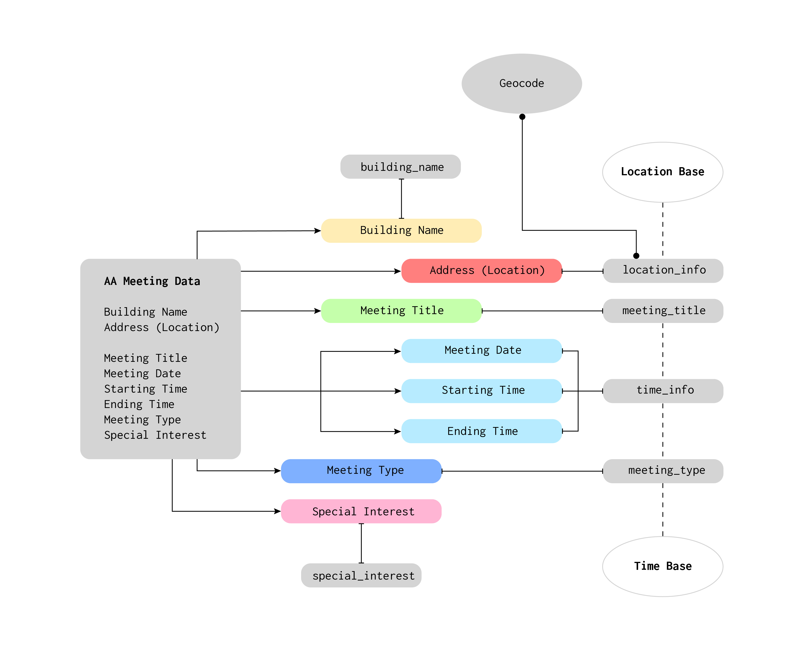

## Weekly Assignment 04

The start code provide by [Aaron Hill](https://github.com/aaronxhill) can be found [here](https://github.com/visualizedata/data-structures/blob/master/weekly_assignment_04.md)

```javascript
const { Client } = require('pg');

// AWS RDS POSTGRESQL INSTANCE
var db_credentials = new Object();
db_credentials.user = 'aaron';
db_credentials.host = 'dsdemo.c2g7qw1juwkg.us-east-1.rds.amazonaws.com';
db_credentials.database = 'mydb';
db_credentials.password = process.env.AWSRDS_PW;
db_credentials.port = 5432;

// Connect to the AWS RDS Postgres database
const client = new Client(db_credentials);
client.connect();

// Sample SQL statement to create a table: 
var thisQuery = "CREATE TABLE aalocations (address varchar(100), lat double precision, long double precision);";
// Sample SQL statement to delete a table: 
// var thisQuery = "DROP TABLE aalocations;"; 

client.query(thisQuery, (err, res) => {
    console.log(err, res);
    client.end();
});
```

## Solution
**Part One: Plan**

Before to build the data mode, I rearranged the AA Meeting's data into six categories: building name, location infomation, meeting title, time information, meeting type, and special interest.



As the concept to make a design for a particular organization's needs, I was inspired by the idea of denormalized data. The data model should focus on four entities: location, time, meeting, and special interest.
