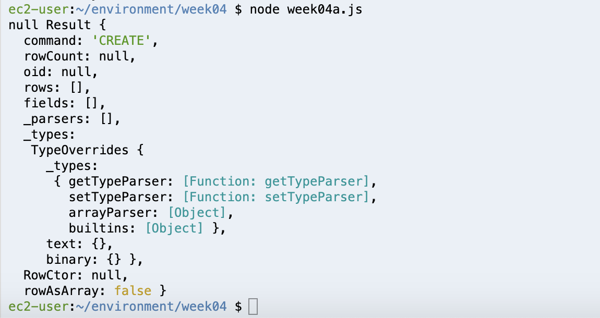

## Weekly Assignment 04

The start code provide by [Aaron Hill](https://github.com/aaronxhill) can be found [here](https://github.com/visualizedata/data-structures/blob/master/weekly_assignment_04.md)

```javascript
const { Client } = require('pg');

// AWS RDS POSTGRESQL INSTANCE
var db_credentials = new Object();
db_credentials.user = 'aaron';
db_credentials.host = 'dsdemo.c2g7qw1juwkg.us-east-1.rds.amazonaws.com';
db_credentials.database = 'mydb';
db_credentials.password = process.env.AWSRDS_PW;
db_credentials.port = 5432;

// Connect to the AWS RDS Postgres database
const client = new Client(db_credentials);
client.connect();

// Sample SQL statement to create a table: 
var thisQuery = "CREATE TABLE locationInfo (address varchar(100), lat double precision, long double precision);";
// Sample SQL statement to delete a table: 
// var thisQuery = "DROP TABLE locationInfo;"; 

client.query(thisQuery, (err, res) => {
    console.log(err, res);
    client.end();
});
```

## Solution
**Part One: Plan**

Before to build the data mode, I rearranged the AA Meeting's data into six categories: building name, location infomation, meeting title, time information, meeting type, and special interest.


As the concept to make a design for a particular organization's needs, I was inspired by the idea of denormalized data. The data model should focus on four entities: location, time, meeting, and special interest. The foreign key (FK) gave an access between each table.


**Part Two: Create a table(s) in the database**

Modify the following starter code to replace the database credentials with my own. It includes two SQL sample statements that I can modify to accomplish any of the following tasks in my new database, with the help of the `pg` module in Node.

```javascript
const { Client } = require('pg');

// AWS RDS POSTGRESQL INSTANCE
var db_credentials = new Object();
db_credentials.user = 'yujunmjiang';
db_credentials.host = 'data-structures.cmqqziujkrxh.us-east-1.rds.amazonaws.com';
db_credentials.database = 'aa';
db_credentials.port = 5432;

// Connect to the AWS RDS Postgres database
const client = new Client(db_credentials);
client.connect();

// // Sample SQL statement to create a table: 
var thisQuery = "CREATE TABLE locationInfo (address varchar(100), lat double precision, long double precision);";
// Sample SQL statement to delete a table: 
// var thisQuery = "DROP TABLE locationInfo;"; 

client.query(thisQuery, (err, res) => {
    console.log(err, res);
    client.end();
});
```

Here is my example in `console.log()`.



Important: hide database credentials key using `.env` file.
```javascript
const dotenv = require('dotenv');
dotenv.config();
```

```javascript
db_credentials.password = process.env.AWSRDS_PW;
```

**Part Three: Populate the database**

Use the [`pg` module](https://node-postgres.com/) in Node to insert my AA data in the database I created. Modify the starter code to replace the database credentials with my own. It includes three SQL queries that I can modify to accomplish the following tasks in my new database, with the help of the `pg` module in Node.

```javascript
var addressesForDb = [ { address: '7 E 10TH ST, New York, NY', latLong: { lat: 40.6482599, lng: -73.9704806 } }, { address: '155 E 22ND ST, New York, NY', latLong: { lat: 40.7384244, lng: -73.9840055 } }, { address: '61 FOURTH AVE, New York, NY', latLong: { lat: 40.7307719, lng: -73.9903164 } } ];
```

```javascript
var thisQuery = "INSERT INTO locationInfo VALUES (E'" + value.address + "', " + value.latLong.lat + ", " + value.latLong.lng + ");";
```

To check what is in my new database table, query all of its contents.

```javascript
var thisQuery = "SELECT * FROM locationInfo;";
```
