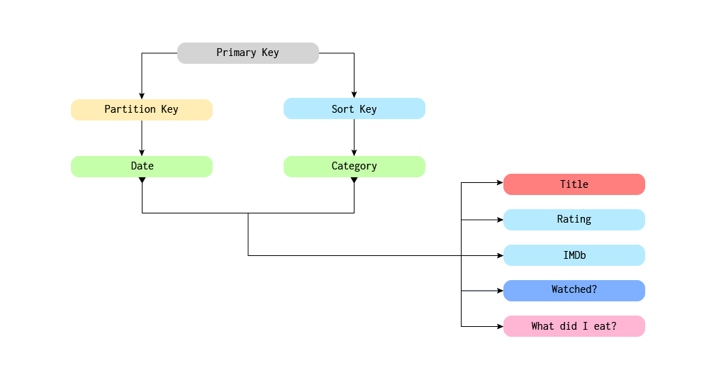
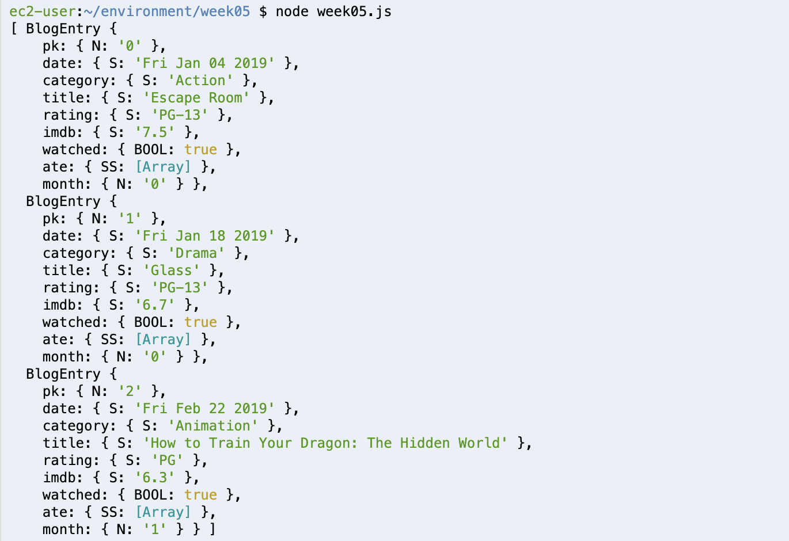
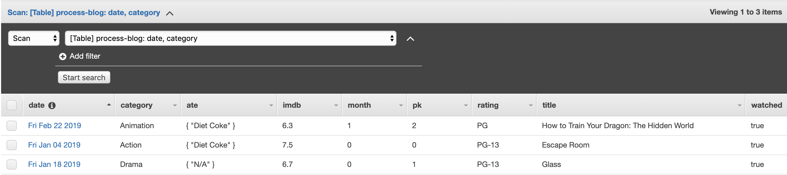

## Weekly Assignment 05

The start code provide by [Aaron Hill](https://github.com/aaronxhill) can be found [here](https://github.com/visualizedata/data-structures/blob/master/weekly_assignment_05.md)

```javascript
var AWS = require('aws-sdk');
AWS.config = new AWS.Config();
AWS.config.region = "us-east-1";

var dynamodb = new AWS.DynamoDB();

var params = {};
params.Item = blogEntries[0]; 
params.TableName = "processblog";

dynamodb.putItem(params, function (err, data) {
  if (err) console.log(err, err.stack); // an error occurred
  else     console.log(data);           // successful response
});
```

## Solution
**Part One: Plan**

This dataset is about all the movies that have been released in 2019 and my personal watching history. I choose the release date as `partition key` and movie category as `sort key`. The dataset also include movie title, rating, IMDb score, and two related questions (e.g. Did I watch this movie? / What did I eat in the theatre?)



**Part Two: Create a table(s) in the database**

Use the [AWS SDK for JavaScript](https://docs.aws.amazon.com/AWSJavaScriptSDK/latest/) to work with your DynamoDB table in Node.js. Install with:  
`npm install aws-sdk`

```javascript
// AWS DynamoDB setup
var AWS = require('aws-sdk');
AWS.config = new AWS.Config();
AWS.config.region = "us-east-1";
var dynamodb = new AWS.DynamoDB();
```

The following code creates several "Items" destined for DynamoDB (adhering to the expected Item attributes and values), storing them in an array named `blogEntries`.

```javascript
// Define blog entry
var blogEntries = [];

// Create categories for blog entry
class BlogEntry {
  constructor(primaryKey, date, category, title, rating, imdb, watched, ate) {
    this.pk = {};
    this.pk.N = primaryKey.toString();
    this.date = {}; // Partition key
    this.date.S = new Date(date).toDateString();
    this.category = {}; // Sort key
    this.category.S = category;
    this.title = {};
    this.title.S = title;
    this.rating = {};
    this.rating.S = rating;
    this.imdb = {};
    this.imdb.S = imdb;
    this.watched = {};
    this.watched.BOOL = watched;
    if (ate != null) {
      this.ate = {};
      this.ate.SS = ate;
    }
    this.month = {};
    this.month.N = new Date(date).getMonth().toString();
  }
}

// Push data into blog entry
blogEntries.push(new BlogEntry(0, 'January 4 2019', "Action", "Escape Room", "PG-13", "7.5", true, ["Diet Coke"]));
blogEntries.push(new BlogEntry(1, 'January 18 2019', "Drama", "Glass", "PG-13", "6.7", true, ["N/A"]));
blogEntries.push(new BlogEntry(2, 'February 22 2019', "Animation", "How to Train Your Dragon: The Hidden World", "PG", "6.3", true, ["Diet Coke"]));

console.log(blogEntries);
```

Here is my example in `console.log()`.



**Part Three: Populate the database**

Base on the `blogEntries` array in the previous step, use the AWS SDK to put the first Item into the DynamoDB table. 

```javascript
// Use 'for' loop to push all the data into blog entry
var params = {};
var i = 0;
for (i = 0; i < blogEntries.length; i++) {
  params.Item += blogEntries[i];
}
params.TableName = "process-blog";

async.eachSeries(blogEntries, function(movie, callback) {
  params.Item = movie;
  dynamodb.putItem(params, function(err, data) {
    if (err) console.log(err, err.stack); // an error occurred
    else console.log(data); // successful response
  });
  setTimeout(callback, 2000);
});
```

Here is my example on `DynamoDB`.


