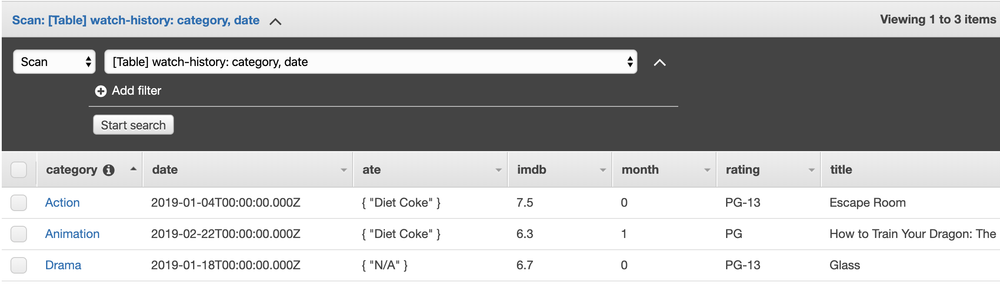

## Weekly Assignment 06

The start code provide by [Aaron Hill](https://github.com/aaronxhill) can be found [here](https://github.com/visualizedata/data-structures/tree/master/weekly_assignment_06)

#### Starter Code for AA data PostgreSQL: 

```javascript
const { Client } = require('pg');
const cTable = require('console.table');

// AWS RDS POSTGRESQL INSTANCE
var db_credentials = new Object();
db_credentials.user = 'aaron';
db_credentials.host = 'dsdemo.c2g7qw1juwkg.us-east-1.rds.amazonaws.com';
db_credentials.database = 'mydb';
db_credentials.password = process.env.AWSRDS_PW;
db_credentials.port = 5432;

// Connect to the AWS RDS Postgres database
const client = new Client(db_credentials);
client.connect();

// Sample SQL statement to query meetings on Monday that start on or after 7:00pm: 
var thisQuery = "SELECT mtgday, mtgtime, mtglocation, mtgaddress, mtgtypes FROM aadata WHERE mtgday = 'Monday' and mtghour >= 7;";

client.query(thisQuery, (err, res) => {
    if (err) {throw err}
    else {
        console.table(res.rows);
        client.end();
    }
});
```

#### Starter Code for Dear Diary data DynamoDB: 

```javascript
// npm install aws-sdk
var AWS = require('aws-sdk');
AWS.config = new AWS.Config();
AWS.config.region = "us-east-1";

var dynamodb = new AWS.DynamoDB();

var params = {
    TableName : "aarondiary",
    KeyConditionExpression: "#tp = :topicName and dt between :minDate and :maxDate", // the query expression
    ExpressionAttributeNames: { // name substitution, used for reserved words in DynamoDB
        "#tp" : "topic"
    },
    ExpressionAttributeValues: { // the query values
        ":topicName": {S: "work"},
        ":minDate": {N: new Date("August 28, 2019").valueOf().toString()},
        ":maxDate": {N: new Date("December 11, 2019").valueOf().toString()}
    }
};

dynamodb.query(params, function(err, data) {
    if (err) {
        console.error("Unable to query. Error:", JSON.stringify(err, null, 2));
    } else {
        console.log("Query succeeded.");
        data.Items.forEach(function(item) {
            console.log("***** ***** ***** ***** ***** \n", item);
        });
    }
});
```

## Solution
**Part One: Write and execute a query for AA data PostgreSQL**

Base on the data model in [weekly assignment 04](https://github.com/yujunmjiang/data-structures-fall-19/tree/master/week04), I used SQL statement to query address and Geocode from AA dataset.

```javascript
var thisQuery = "SELECT address, lat, long FROM locationInfo;";
```

Here is my example in `console.log()`.


**Part Two: Write and execute a query for Dear Diary (Movie Watch History) data DynamoDB**

I exchanged `partition key` and `sort key` in [weekly assignment 05](https://github.com/yujunmjiang/data-structures-fall-19/tree/master/week05). Meanwhile, I have removed `primary key` (default order by number). The date string has been updated from `.toDateString()` to `.toISOString`.

```javascript
// this.pk = {};
// this.pk.N = primaryKey.toString();
this.category = {}; // Partition key
this.category.S = category;
this.date = {}; // Sort key
this.date.S = new Date(date).toISOString();
```

Here is my example on `DynamoDB`.



Here is my example in `console.log()`.


